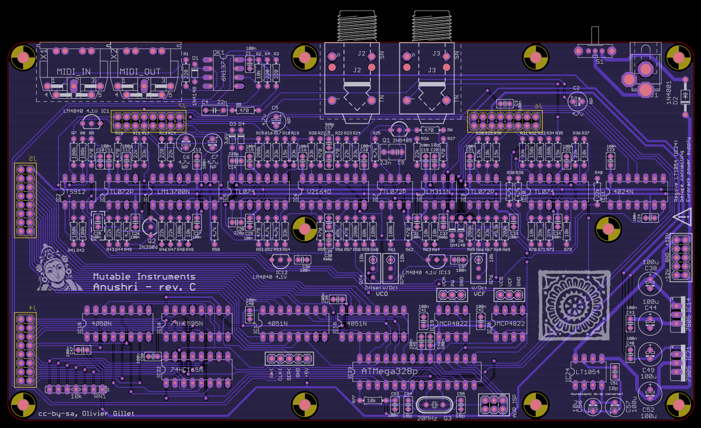
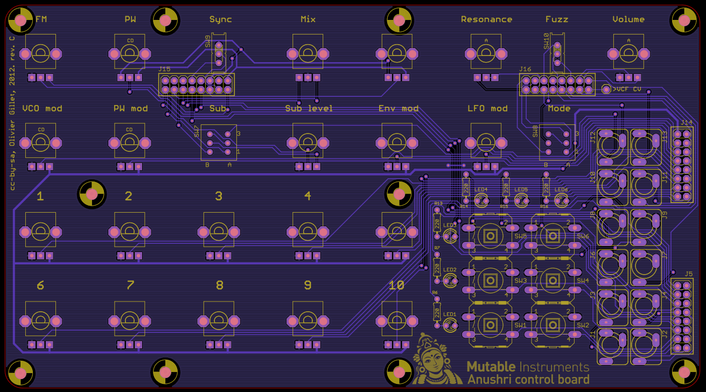

Anushri is made of two circuit boards. The first board (main board) is holding the power supply, the whole analog synthesis signal chain, the MIDI interface and the main processor. The second board (control board) contains all the controls (switches, pots, LEDs, and connectors). A consequence of that is that builders with a love for panel-mounted controls can build the main board and just wire all the controls to it. We don't recommend that unless you have some insane passion to show.

Schematics and PCB
------------------

-   [Main board schematics](../static/schematics/Anushri-revC.pdf) in PDF format.
-   [Control board schematics](../static/schematics/Anushri-Control-revC.pdf) in PDF format.
-   Main board [top](../static/images/anushri_main_top.pdf) and [bottom](../static/images/anushri_main_bottom.pdf) part placement.
-   [Control board part placement](../static/images/anushri_control_top.pdf).

You can find the Eagle files for this board in the source code hosted on [github](https://github.com/pichenettes/anushri/tree/master/anu/hardware_design/pcb).

Bill of materials
-----------------

[Bill of Materials](https://docs.google.com/spreadsheet/pub?key=0Ai4xPbRS5YZjdFdxYnZoMS15UHF5c2F4eW5uVWsyVnc&output=html).

Some friendly notes for the self-sourcing crowd:

-   Digikey resistor values might be a bit different due to strict adherence to the E-series. This is not a problem.
-   A J112 can be used as a substitute for the 2N5458. A BF245 can also be used, but it needs to be mounted backwards because of a different pinout.
-   The TS912 is an unusual - but justified here - choice of op-amp. Look for +/- 5V operation and true rail to rail I/O if you want to source a substitute.
-   Voltage references (LM4040) are available in different precision grades identified by letters A, B, C, D. For integration into a modular setup and precise CV in/out, it is recommended to use the A or B grades. C grade is fine for standalone use.
-   If pots with center-detent are hard to find, you can use a standard part. When it matters, the software scanning the pot will still apply a "virtual notch" to the center of the pot.

Building for Eurorack
---------------------

If you want to build Anushri as an Eurorack module:

-   Do not solder the input/output connectors at the back of the unit (MIDI, audio IN/OUT, on/off switch, DC power).
-   Do not insert the LT1054 DC-DC converter in its socket.
-   Solder a 2x5 power connector (-12V, ground, ground, ground, +12V) on the edge of the main board.

The rack-mounting kit contains a spare panel that can be used to relocate the MIDI I/O and the 6.35mm audio output to the front panel.

Assembly instructions
---------------------

Some equipment you'll need:

1.  Soldering iron + solder (nothing fancy, a 15 or 20W will do).
2.  Cutters.

We assume you know soldering. If you don't, look first at [this tutorial](http://www.instructables.com/id/How-to-solder/).

**DISCLAIMER: ** We are not responsible for anything wrong (including electric shocks, malfunctions, fires, accidents involving a soldering iron) that might happen during the assembly of the kit. Everything you do while assembling the kit is at your own risks.

### Resistors

The assembly starts with the main board.

All resistors have a 1% tolerance so their last ring is always brown (if it isn't, you are looking at it backwards). It is recommended to test the value of one resistor from each strip before stuffing them in the board.

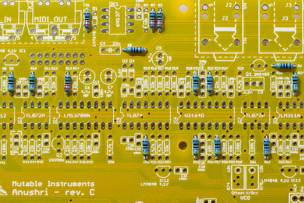

Start with the 100's decade:

-   4x 220R resistors (red, red, black, black) at positions R1, R3, R4, R13.
-   11x 470R resistors (yellow, purple, black, black) at positions R5, R6, R9, R10, R21, R22, R27, R51, R55, R57, R62.

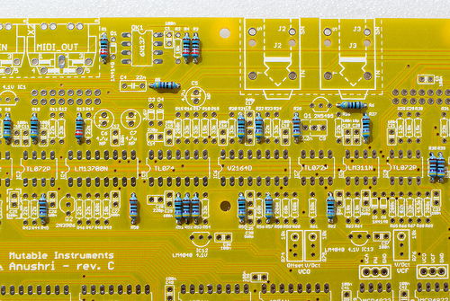

The 1k's decade:

-   7x 4.7k resistors (yellow, purple, black, brown) at positions R25, R38, R39, R45, R50, R52, R53.

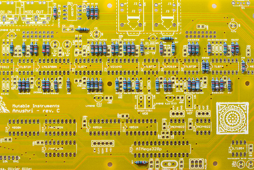

The 10k's decade:

-   9x 10k (brown, black, black, red) at positions R2, R29, R37, R49, R63, R64, R70, R73, R77.
-   1x 12k (brown, red, black, red) at position R28.
-   3x 15k (brown, green, black, red) at positions R18, R30, R35.
-   10x 22k (red, red, black, red) at positions R11, R14, R23, R26, R36, R40, R43, R44, R46, R47.
-   1x 27k (red, purple, black, red) at position R72.
-   9x 33k (orange, orange, black, red) at positions R12, R16, R17, R19, R20, R24, R31, R54, R67.
-   1x 39k (orange, white, black, red) at position R71.
-   1x 49.9k (yellow, white, white, red) at position R68.
-   1x 62k (blue, red, black, red) at position R66.
-   2x 68k (blue, grey, black, red) at positions R56, R59.

The 100k's decade:

-   9x 100k (brown, black, black, orange) at positions R7, R8, R33, R34, R41, R42, R48, R60, R61.
-   1x 150k (brown, green, black, orange) at position R32.
-   4x 200k (red, black, black, orange) at positions R15, R58, R65, R69.

### Diodes

Diodes are polarized, and their polarity is indicated by a ring. This should match the ring/stripe printed on the circuit board.

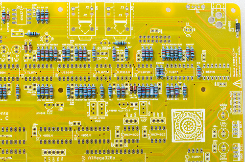

-   3x 1N4148 (1N4148 printed on the body of the diode) at positions D1, D5, D6.
-   2x 3.6V Zener (1N5227B or BZX79 C3V6) at positions D3 and D4.
-   1x 1N400x (large, power supply protection diode) at position D2. 1N4001, 1N4002, 1N4003, 1N4004 only differ by their current/voltage ratings, all are fine for this project.

You can also add at this stage the quartz crystal at position Q3. It is not polarized.

### Ceramic capacitors

Ceramic capacitors look like yellow or blue "drops". They are not polarized.

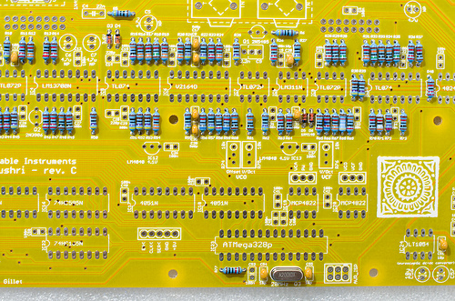

-   2x 10pF (100) at positions C20, C51.
-   2x 18pF (180) at positions C54, C55.
-   1x 100pF (101) at position C12.
-   5x 560pF (561) at positions C8, C17, C30, C32, C35.

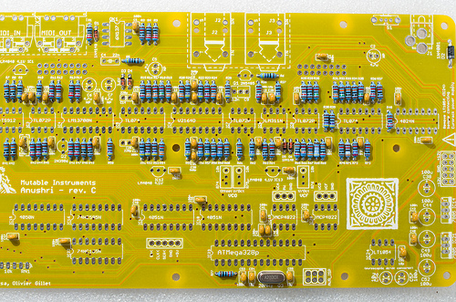

-   33x 100nF (104).

### IC sockets

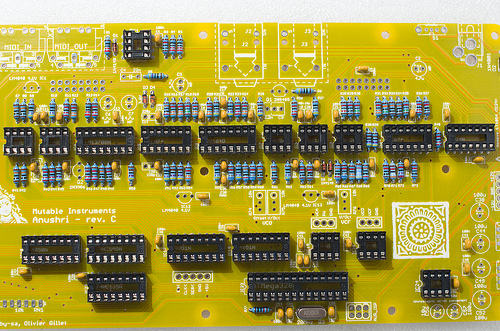

Add the IC sockets. It is strongly recommended to align the notch of the IC socket with the notch on the symbol printed on the PCB.

-   9x DIP8.
-   3x DIP14.
-   7x DIP16.
-   1x DIP28.

### Transistors, special resistors and capacitors

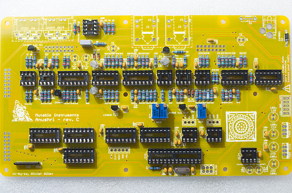

Add:

-   3x trimmers. The adjustment screws should be on the same side as on the symbol printed on the board.
-   3x LM4040 voltage references, 1x 2N3906 transistor and 1x 2N5485. Check the symbol printed on the board for their alignment.
-   1x 22nF film capacitor (C4).
-   2x 220pF styroflex capacitor (C14, C28).
-   1x 2.2nF styroflex capacitor (C9). You can solder it to pins 1 3 (leaving the middle pin) or to pins to 2 3 (leaving the left pin) depending on the size of the part. See the image below.
-   1x 1.6 10k resistor network. See the image below for orientation: the dot on the resistor network should be on the same side as the **1** printed on the board.

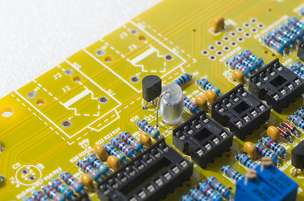

### Electrolytic and tantalum capacitors

Add 4x 4.7uF non-polarized capacitors. Just ignore the +/- printed on the board - these parts are not polarized.

Add 5x 100uF electrolytic capacitors. These parts are polarized, the +/- is printed on the PCB. The negative lead is identified by a white stripe and a shorter lead.

Add 1x 10uF tantalum capacitor. The positive lead is identified by a stripe on the capacitor.

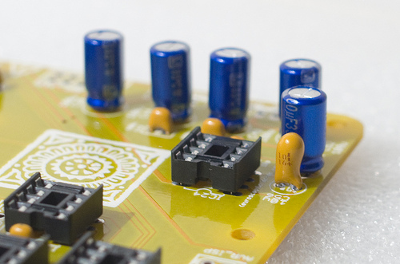

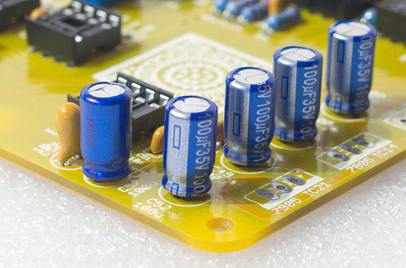

### Power supply

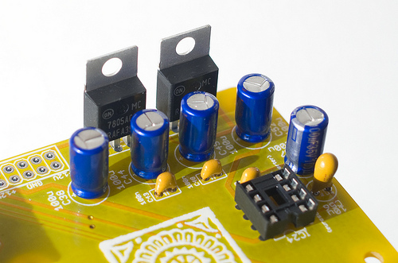

Add the two voltage regulators (LM7805 and LM7905). These are two different parts, don't mix them up even if they look similar.

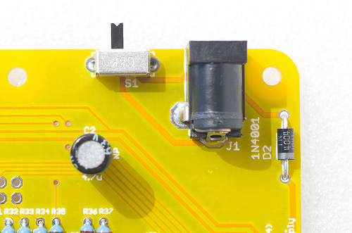

Add the DC jack and power switch. You don't have to solder the power switch if you intend to mount the unit behind a Euro panel.

### Connectors

Add the main audio in/out connectors - unless you intend to mount the unit behind a panel for your Eurorack setup of course.

Add the 2x3 ISP connector (unless you don't have an AVR programmer or are not interested in firmware development).

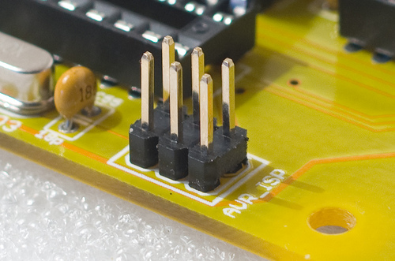

Solder the 4x male 2x8 connectors used to connect the two boards. Note that they are on the other side of the board.

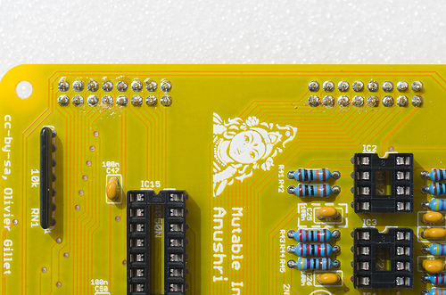\
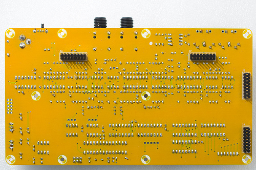

Finally, add the MIDI connectors

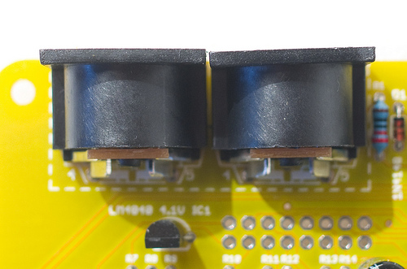

That's it! You can insert the IC. Note that the TS912 used in the first batch of kits is now replaced by the more modern TLV2372. Here's how the finished board looks like:

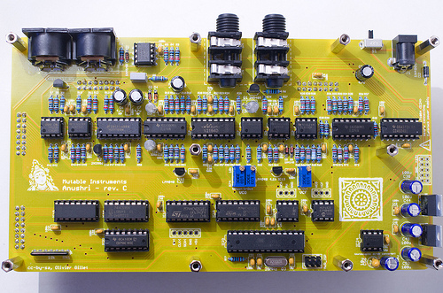

Now, let's move to the control board.

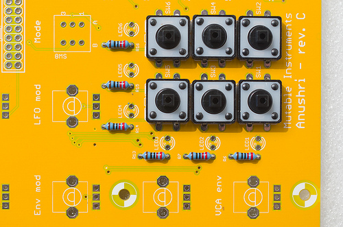

-   Add the 6x 220R resistors (red, red, black, black).
-   Add the 6x switches.
-   Add the 6x LEDs. Note that they are polarized. The symbol printed on the board shows a round side (+) and a flat edge (~~). The long lead of the LED is the (+), the short one the (~~). See the image below for reference.

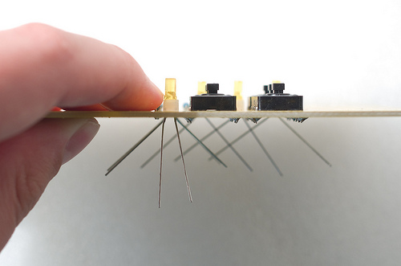

-   Add the 4x 2x8 female connectors on the other side of the board.

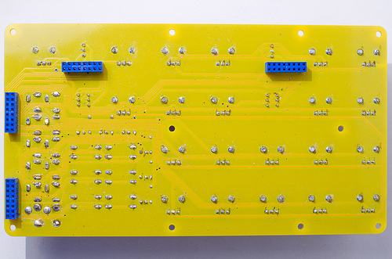

**Anushri uses three different kinds of pots. Don't mix them up!**

-   Add the 12x jack connectors. It is recommended to solder only one leg (the middle one) of all of them first, so that their position can be easily tweaked for optimal alignment. Once you are satisfied with their alignment, solder the two remaining legs.
-   Add the 2x DPDT and 2x SPDT switches.
-   Add the 2x 100k pots with audio taper (resonance and main volume). An A is printed on the pot symbol on the PCB; and to identify the right part you can read "FA 100K" under the pot. If you are unsure which pot is which, check the resistance between the first and third lead before soldering them.
-   Add the 3x 10k pots with center detent. A "CD" label is printed on the pot symbol on the PCB; and to identify the right part you can try turning the pot and check for the click/detent at 12'o'clock. These are used for the pulse-width, and LFO/ENV pitch and PWM modulation where the central position of the pot corresponds to a neutral setting.
-   Add the remaining 16 10k pots.

Here is how it looks like with switches and knobs (not really necessary at this stage...) in place.

### Test and calibration

#### VCO calibration

VCO calibration is needed only if you plan to use the CV in/out for accurate pitch control. Otherwise, you can let the software tune the unit by holding the "hold" button and pressing "run/stop". You should hear a low-volume arpeggio (played by the unit to measure the pitch produced by the VCO for a few test voltages). When the unit is software-tuned, the VCO will react incorrectly to external VCO CV signals, and will produce VCO CV signals which are slightly off (since they have the compensation of software-tuning built into them).

The calibration procedure consists in the following steps:

1.  Power the unit on and leave it on for a few minutes.
2.  Make sure that oscillators sync is disabled. The **sync** switch must be to the low position.
3.  Hold the "hold" button and press "rec" to disable software correction of tuning.
4.  Set the pot labelled "2" to its minimal position.
5.  Adjust the two VCO trimmers (offset and scale) until the synth plays in tune in the C1 - C4 range. Note that tuning accuracy starts to degrade below 50 Hz due to some internal resistance on the SSM2164 inputs (which are not true virtual grounds), and above 2kHz due to integrator reset time compensation through R25 falling apart, and deviation from exponential response from the SS2164.

#### VCF calibration

1.  Dial a patch in which the oscillators are silent. This can be achieved by enabling **sync** and setting the oscillators pitch to a very low value.
2.  Disable the envelope / LFO modulation on filter cutoff.
3.  Set cutoff to a middle value.
4.  Set resonance to a maximum value.
5.  You should hear the self-oscillation tone. Adjust the V/Oct trimmer so that the intervals are respected – that is to say, when you play C3 then C4, you should hear two notes, maybe not C3s and C4s, but they must be one octave apart. If you do not have a good sense of pitch, you can try a software tuner like Tuna Pitch on OS X. If the filter is correctly tuned, you should be able to play the filter "self oscillation tone" across roughly 4 octaves with correct tuning.

Note that VCF tuning might vary a bit with temperature, so there is no need to spend too much time on this!

### Mechanical assembly

The following mechanical parts are used to hold the boards and the case together:

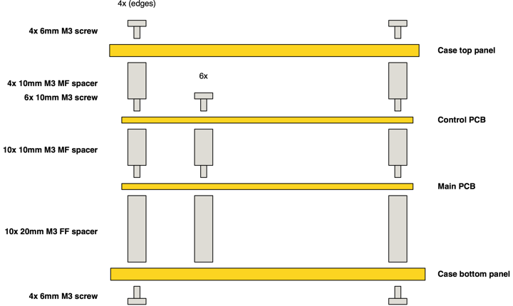

Note that a newer revision of the case has 10 holes, not 4, on its bottom panel.

It is recommended to do the assembly from the inner to the outer - start by assembling the two boards together...

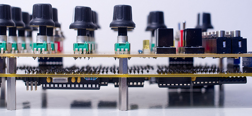

... Then screw the top and bottom case panels to them, and finish the assembly of the case with the left, right, front and back panels.

Troubleshooting
---------------

### Power distribution

You can click on the image to open larger versions.

[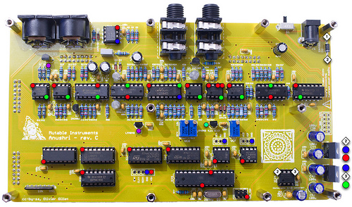](https://c1.staticflickr.com/9/8430/7711692322_178406054a_h.jpg)

-   **blue points**: ground (can be used as a reference point for voltage measurements).
-   **1**: Input DC voltage, should be in the 7.5V..12V range, preferably with little ripple.
-   **2**: Input DC voltage post protection diode - a voltage drop of a few hundred mV should be observed.
-   **3**: Output of voltage inverter. Should be close to the voltage at point 2 in absolute value, but negative.
-   **red points**: +5V, ±2%.
-   **green points**: -5V, ±2%.
-   **purple points**: +4.1V, ±1%.
-   **cyan point**: -4.1V, ±1%.

### Signal path

Use one of the **GND** pads as a reference for voltage measurements. If you don't have a scope, the verification of audio signals can be done by connecting the signal to a high-impedance amplifier (mixer or sound-card input, if possible switched to "high-Z" mode).

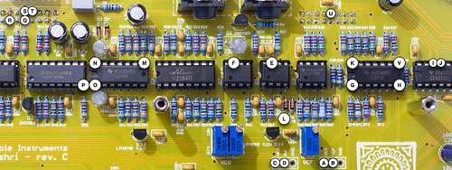

-   **A**: VCO CV. With default patch, C3 = 2.048V, 0.5 V/Oct. Affected by ENV or LFO VCO modulations, mod-wheel... Might be scaled or offset if software tuning is used.
-   **B**: VCF modulations CV. Centered at 2.048V, 0.25 V/Oct. By default, should track with keyboard, and affected by envelope and LFO modulations.
-   **C**: VCA CV. 0V at rest; 4.1V at full amplitude.
-   **D**: PWM modulation CV. 0V at rest, goes up to 4.1V when a LFO or ENV modulation is applied at full amount.
-   **E**: VCO reset pulse. 0V, with a short pulse close to +5V at each period of the VCO.
-   **F**: VCO sawtooth core signal. 0 to 2.5V, ramping up.
-   **G**: VCO sawtooth core signal, DC offset largely removed, ramping down.
-   **H**: VCO square signal derived from the sawtooth.
-   **I**, **J**: sub-oscillator -1 octave and -2 octaves signals.
-   **K**: mixer output.
-   **L**: SSM2164 VCF control CV. Near 0V when the filter is fully opened ; near 2.4V when the filter is fully closed.
-   **M**: VCF highpass output.
-   **N**: VCF bandpass output.
-   **O**: VCF lowpass output.
-   **P**: Distortion/fuzz output.
-   **Q**: VCA input signal (BP / HP / LP, with or without fuzz according to the 2 switches in the filter section).
-   **R**: Final output signal.
-   **S**: Drum section signal.
-   **T**: Drum section signal sent to the final input (should be the same as S, unless a patchcord is inserted in the corresponding jack in the control board).
-   **U**: DCO signal (square, 0V to 5V, should track pitch of MIDI note).
-   **V**: VCO tuning feedback signal. Square, should not go below ground.

### MCU

An oscilloscope is required for these checks.

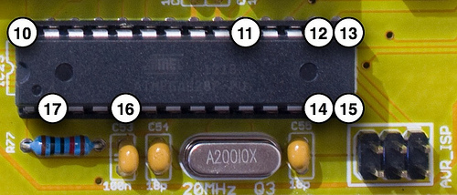

-   **10**: Pot scanner signal. This is a sequence of 14 steps, each about 1.6ms wide, their amplitude equal to the position of each potentiometer. Moving a pot should change the height of a step in the sequence.
-   **11**: DAC clock signal. Bursts of two sequences of 8 steps at 10 MHz.
-   **12**: DCO output signal.
-   **13**: DAC1 selection signal. Pulse at 2.4kHz.
-   **14**: DAC2 selection signal. Pulse at 2.4kHz.
-   **15**: VCO square output, sent back to the MCU for tuning.
-   **16**: Drums PWM signal. Carrier at 39kHz.
-   **17**: MIDI in signal. +5V at rest, dips at 0V when MIDI data is received.

License
-------

This circuit and PCB layout is made available under a **cc-by-sa-3.0** license.

Releases
--------

**revC**

Original release.
