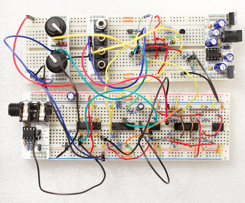
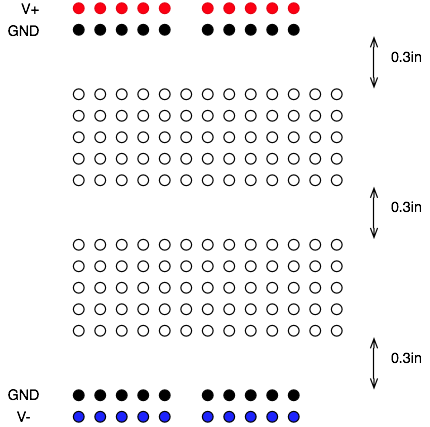
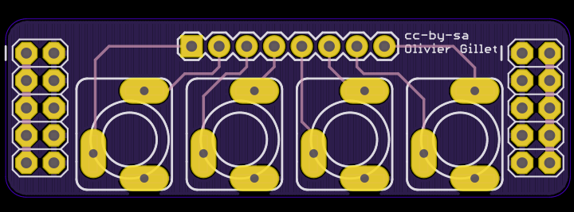
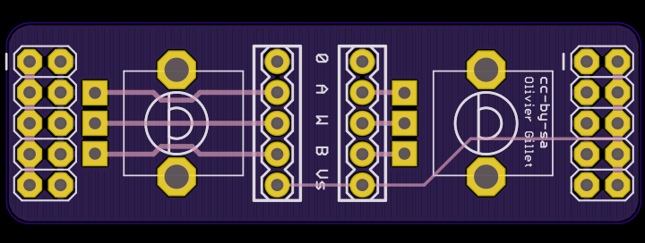
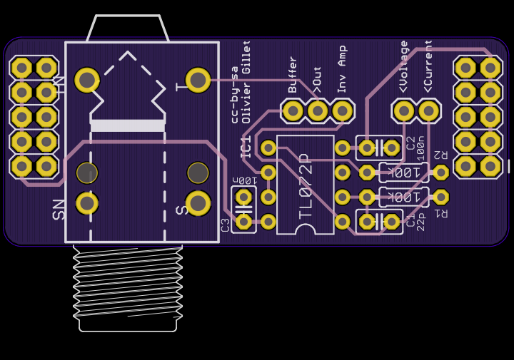

At Mutable Instruments we very often work with solderless breadboards to
prototype audio circuits, and we have designed a collection of small
modules that "ride" on top of breadboards to make our lives easier during those
long hours tweaking circuits.

Over the past years, our list of breadboarding pet peeves included:

-   The jack connector that appeared to fit well, but silently pops out
    after hours of use causing numerous WTF?.
-   The PCB-mounted pot that appeared to fit well, but suddenly jumped
    out and tried to hit our eyes.
-   The pain of breadboarding over and over again the same TL072 amp
    stage or buffer.
-   Messy power supply wires which were never long enough.
-   WTFs because of the wire (dis)connecting the lower and upper row of
    GND.

We've tried to address those issues with the following modules. They
work for most of the breadboards in use here, but not all, so if you
plan to get one, check that it matches your breadboard size too!

This also shows you which convention is used for the rails at the
top/bottom of the board. From top to bottom: positive supply, ground,
ground, negative supply.

+/- 5V (or more) Power supply
-----------------------------

This dual supply based on the LT1054 DC converter can deliver up to 1A
on the positive rail (OK, 1A is a bit unrealistic, it'll get very warm
for such a current), and up to 100mA on the negative rail. It takes as
an input a DC voltage from a standard DC wall-wart with a center-positive connector (labelled as + o) - on the device). You can solder 7805 / 7905 regulators
to get +/-5 V, in which case the input voltage must exceed 7.5V to give
enough headroom to the regulators. You can also use 7808 / 7908
regulators to get +/- 8V, in which case the input voltage must exceed
11V. **Beware! The LT1054 does not tolerate input voltages above 15V**.
It would be risky, but possible, to get +/- 12V.

Connectors for 3.5mm jacks
--------------------------

This board provides connections for four 3.5mm jack connectors into a
standard header. We use it to interface our prototypes with an Eurorack
modular - this is great for generating plenty of interesting test
signals with LFOs and envelopes! For each connector, two pins are
available: one connected to the tip (signal in/out), and one used for
providing a signal when no jack is plugged - so you can normal a value
into an unplugged input.

Potentiometers
--------------

This board consists of two potentiometers; with their 3 terminals (A,
Wiper, B) accessible through headers. You can easily insert jumpers to
ground the lower end of the potentiometer; and to connect the upper end
of the potentiometer to the positive supply voltage.

Audio output
------------

This board hosts a 6.35mm mono jack connector, and an op-amp providing
both a (non-inverting) buffer and an inverting amplifier stage. 4
configurations are available:

-   Connect a cable from your circuit to >Out. The corresponding
    voltage is directly sent to the audio jack.
-   Connect a cable from your circuit to >Voltage, and add a jumper
    between Buffer and >Out. The corresponding voltage is buffered
    and sent to the audio jack.
-   Connect a cable from your circuit to >Voltage, and add a jumper
    between Inv Amp and >Out. The corresponding voltage is inverted
    and sent to the audio jack. Note that the TL072 is not the best
    buffer out there, so we highly recommend you to use this
    configuration if you don't care about the phase of your output
    signal.
-   Connect a cable from your circuit to >Current, and add a jumper
    between Inv Amp and >Out. The corresponding current is converted
    into a voltage (with a gain of 100kOhm). This allows the TL072 on
    the board to be used as the last current->voltage conversion step
    in signal processing chains involving OTAs or VCA chips which
    usually have a current output, rather than a voltage output.

Schematics and layout
---------------------

[Hosted on github](https://github.com/pichenettes/breadboard-friends).

BOM
---

[Bill of
Materials](https://docs.google.com/spreadsheet/pub?key=0Ai4xPbRS5YZjdEhjYnVub2lYOXgwQURFS0dsbGNmNEE&output=html&widget=true).

License
-------

**cc-by-sa-3.0**.
