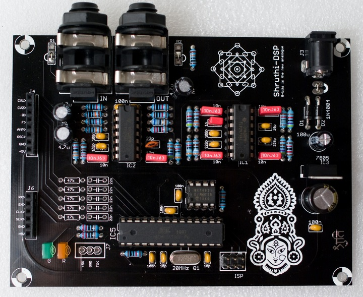
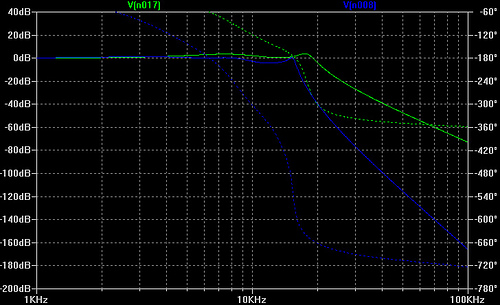

This filter board is a bit unusual. Contrary to its friends, it does not feature any analog signal processing modules. Instead, the oscillators signals (along with the audio input) are converted back into the digital domain and processed by another AVR microcontroller. You don't get the warmth of analogue, but instead, you gain plenty of whacky filter and FX combinations!

We are not ashamed of saying that the sounds coming out of this filter board are pure lo-fi. At best, it's Amiga-scronch, at worst, it's *\[insert here the name of your favorite Arduino-based bleeper\]* crap. In your dreams, this filter board will sound like a WTPA, but when you wake up it won't, and there will be an Alpaca sleeping on your couch.

The signal processing is done with a 12-bits resolution ; except for everything involving delay lines in which case the samples are converted to crunchy 8-bits when written to the delay line.

Using this filter board
-----------------------

Please make sure that both the analog (CV1 to +5V) and digital (RX to +5V) ports of the filter and control boards are connected.

Beware! Only the Shruthi-1 firmware v0.93 or above generates the digital signals required to control this filter board. These digital signals are sent through the output labelled **TX&gt;**. This means that you **can** use the programmer and the digital filter board at the same time. To activate the digital filter board, select **dsp** in the system settings page. If you don't do so, you will not get any sound from the board.

When pressing the **S2** switch (Filter page) a second time, a new page is displayed allowing you to configure the filter and the effects.

     Mod fx. pr1 pr2
     l>f del  30   8

The parameters are the following:

-   mod (mode): Filter configuration. The options are **l&gt;f** (low-pass filter sent to an FX), **h&gt;f** (high-pass filter sent to an FX), **f&gt;l** (FX applied first, sent to a LPF), **f&gt;h** (FX applied first, sent to a HPF), and **[fx]{style="text-align:right;"}** (no filtering, just the DCA and the FX).
-   fx. (fx progr.): Digital effect to apply.
-   pr1 (param. 1): First parameter of the digital effect.
-   pr2 (param. 2): Second parameter of the digital effect.

Here is a list of the available effect programs.

|Name|Description|Param 1|Param 2|
|---|---|---|---|
|distrt|Distortion|Amount of foldback distortion|Amount of fuzz|
|crushr|Bit crusher|Sample rate reduction|Bit depth reduction|
|+cmbfl|Comb filter with positive feedback|Cutoff frequency|Feedback amount|
|-cmbfl|Comb filter with negative feedback|Cutoff frequency|Feedback amount|
|ringmd|Ring modulator|Carrier frequency|Amount|
|delay|Simple delay|Delay time|Amount|
|fb dly|Delay with 30% feedback|Delay time|Amount|
|dubdly|Delay with 80% feedback|Delay time|Amount|
|!fbdelay|Delay with 30% feedback and no antialiasing|Delay time|Amount|
|!dbdly|Delay with 80% feedback and no antialiasing|Delay time|Amount|
|/16 dl|Tempo-synchronized delay|Feedback amount|Amount|
|/12 dl|Tempo-synchronized delay|Feedback amount|Amount|
|/8 dl|Tempo-synchronized delay|Feedback amount|Amount|
|3/16 dl|Tempo-synchronized delay|Feedback amount|Amount|
|looper|Looper|Loop duration/Pitch|Trigger|
|pitch|Pitch shifter|Relative pitch|Amount|

The looper works as follows. When trigger is below 32, it lets the input goes through, and keeps ready a small loop (less than 1 second), whose duration is adjusted by the first parameter. When trigger is above 32, it stops playing the incoming signal and instead plays the recorded loop. The playback pitch can be controlled by the first parameter. Try mapping the pitch bend lever or modwheel to CV1, and an envelope to CV2, and connect an external audio source: every time you press a key, the audio starts looping, and you can use the pitch bend lever to "scratch" it.

The pitch-shifter pitch parameter works as follows: 64 is the original pitch, 65 is the original +1 quarter-tone, 63 is the original -1 quarter-tone. For example, use 64 - 2 x 12 = 40 to generate a sub-octave, or 64 + 2 x 7 = 78 to generate a fifth. Try modulating the pitch with an LFO to get a chorus effect.

There is no flanger program, because a flanger is just a comb filter modulated by a LFO! Thus, you can use the positive or negative feedback comb-filter, and route an LFO to CV1 to make it shine and shimmer. Try something different from an LFO (for example a step sequencer) for more fun!

Given the limited amount of RAM on an ATMega328p (2kb), some pretty heavy downsampling happens when the delay time exceeds 30ms, and the echoes sound more like smudgy bitcrushed sludge than echoes - but early BBD based delay pedals sound like that, too. The first 3 delays, and the tempo-synchronized ones, use a 1-pole low-pass filter on the delay line input and output to make things a bit more tolerable. The versions with a "!" in the name don't use any filtering and will sound like a circuit-bent Dub Barbie.

The G blinkenlight indicates the output level, the R blinkenlight indicates the input level.

Dirty technical details
-----------------------

### Signal path



The Shruthi-1 output signals are PWM-modulated: they have a high frequency peak at the PWM modulation frequency (39kHz) which would cause some horrible amount of aliasing if sampled directly. For this reason, the mix of the oscillators and external audio input is filtered by an 8-pole Chebyshev filter (response in blue) with a cutoff frequency of 16kHz.

After being digitally processed on the AVR, the signal is converted back to the analogue domain by a proper 12-bits DAC, and further filtered to remove high frequency components (something that is not done on the other filter boards, since there is an analog filter to do all this cleaning up!). Chebyshev filters have some ripple in the pass-band (and even more if you constrain RC components values to be in the E24/E6 series), but they are steep! The response of this final filter is plotted in green on the graph above. The ripple translates into some slightly "resonant" coloration of the high-end. At least that's what Sonic Visualizer told me.

### What about the CVs?

The original plan was to filter the 5 CV signals (VCA, cutoff, resonance, CV1, CV2) with passive RC filters with a 150 Hz cutoff (R = 47k, C = 22n), and sample them using the ADC of the AVR. We even had found a smart way of doing this: use a timer clocked at 80kHz, sample from the oscillators signal every even frame, and from one of the CVs on every odd frame. This plan did not work well for three reasons:

1.  The extra code required to round-robin and switch the ADC, but most importantly the ISR preludes/postludes (10 register to push, then pop, twice per sample), ended up using too much CPU.
2.  The ADC clock needed to be run at a pretty high speed (actually above the maximum rated speed), with incessant switching between the channels, to allow the sampling of the audio signal and the CVs. This caused all kinds of annoying signal degradations.
3.  The RC filter was not good enough at removing the PWM carrier from the CV signals. This introduced a lot of nasty ringing noise on all the CVs. Digital filtering of the CV signals did help - but introduced a delay/slew rate limitation that harmed the envelope speed. Suddenly it was all foamy and bubbly.

The solution? It is a digital filter board after all, so let's send the CVs digitally. No kidding. When the filter board is set to **dsp** on the Shruthi digital board, the second UART of the main ATMega644p (whose TX line is exposed on the **Output expansion** port) runs at 115200 baud and transmits the CVs. The ATMega328p on the digital filter board reads them. It means that:

**This filter board can only be controlled by a Shruthi-1**. You cannot use it as a stand-alone filter by feeding CVs into it. Indeed, it will not do anything with the signals fed to the VCA, frequency, resonance, CV1 and CV2 inputs.

Well, it is not entirely true: this filter board can be controlled by whatever speaks our patent-pending *CV update through a 115200 bps serial link* protocol. The protocol consists of repeatedly sending the following sequence of 12 bytes. At the exception of the first byte in the sequence, all values are in the 0-254 (0xfe) range. The interleaving of cutoff / VCA values allows a higher refresh rate for those sensitive signals.

1.  Beginning of sequence marker, always equal to 0xff.
2.  Cutoff value.
3.  Configuration byte 0xmn, where the nibble m is the configuration of the filter (0 for LP, 1 for BP, 2 for HP), and where the nibble n is the FX program number.
4.  VCA value.
5.  Tempo byte.
6.  Cutoff value.
7.  Resonance value.
8.  VCA value.
9.  FX parameter 1 value (CV1).
10. Cutoff value.
11. FX parameter 2 value (CV2).
12. VCA value.

Note that the PCB still has the 5 passive RC filters on the CV inputs and traces connecting them to the ADC inputs of the AVR, and that you can build a version of the DSP firmware that reads them, instead of receiving the data from the serial link (Just \#define USE\_ANALOG\_CV in `dsp.h`). So if analog CVs and gritty digital noises are your thing, you can hack them back - but beware that some effects will be broken because of the increased CPU load.

Schematics and PCB
------------------


You can find the Eagle files for this board in the dsp/hardware\_design/pcb directory of the source code hosted on [github](http://github.com/pichenettes/shruthi-1/tree/master/dsp).

The schematics in PDF format are [here](../static/schematics/Shruthi-DSP-v02.pdf).

Bill of materials
-----------------

[Bill of materials](https://docs.google.com/spreadsheet/pub?key=0Ai4xPbRS5YZjdDU1UkFfLVppTWlMYjVocEVEeE9JekE&output=html&widget=true).

If you want to process some CV signals (beware: you'll need to write code for that!), the following parts can be added:

|Index|Description|Value|Quantity|Reichelt|Digikey|Farnell|Other|
|-----|-----------|-----|--------|--------|-------|-------|-----|
|R24, R25, R27, R28, R29|Resistor 1%|47k|5|METALL 47,0k|47.5KXBK-ND|**9341960**| |
|C21, C22, C24, C26, C28|Film cap|22n|5|**MKS-2-5 22N**|BC1646-ND|1166080|.|

Firmware
--------

The firmware code is hosted on [github](http://github.com/pichenettes/shruthi-1), in the `dsp` directory. It can be built and sent to the MCU with:

````
make -f dsp/makefile bake
````

Sorry, there's no "firmware update over MIDI" thing for this, since the MCU on the board runs independently of the ATMega644p on the digital board -- which is the guy connected to the MIDI input.

If you want to hack your own FX algos, the place to look at is one of the `void FxEngine::RenderEffectName` static methods. Your mission, if you accept it, is to transform (in place) the buffer of `kAudioBlockSize` samples called `samples_`. Samples are 12 bits, signed (from -2048 to +2047). You can read the parameters with `filtered_cv(CV_1)` and `filtered_cv(CV_2)`. You have roughly 200 CPU cycles per sample, and if you want to time your code, you can probe the >TX pin (pin 3) of the AVR - when this line is high the MCU is processing samples, when it is low it is, as we say in french, *en train de se branler la nouille*.

License
-------

w00t, this filter board is made available under a **cc-by-sa-3.0** license.

Releases
--------

### v0.2

-   Added bypass caps on Vcc/2 line.
-   Added tStop/bStop layers on "Shruti" text.
-   Increased CV filtering caps (yeah, before realizing they won't be needed...).

### v0.1

-   First prototype.

