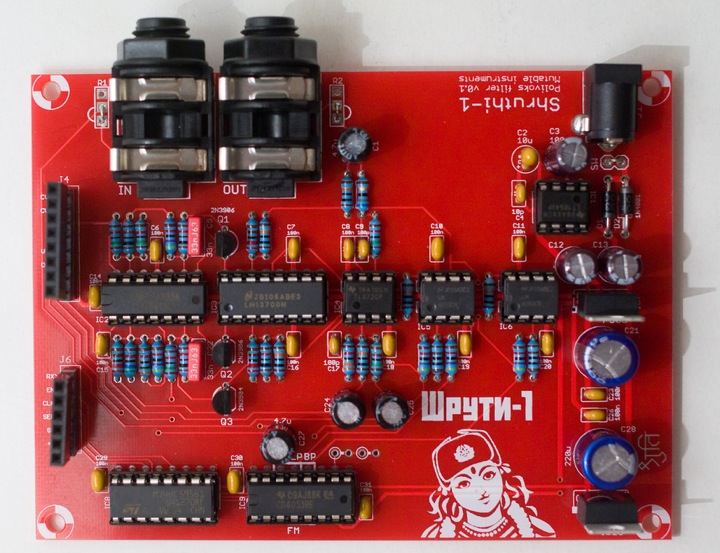
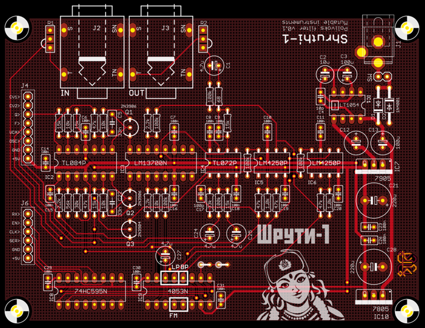

Super baaad! This filter board is packed with anger and nastiness. It features the unique low-pass/band-pass filter circuit of the [Polivoks](http://www.vintagesynth.com/misc/polivoks.php) with two additional distortion modes providing an even harsher sound.

Using this filter board
-----------------------

Please make sure that both the analog (CV1 to +5V) and digital (RX to +5V) ports of the filter and control boards are connected.

Beware! Only the Shruthi-1 firmware v0.95 (or above) generates the digital signals required to control the mode selection and routing matrix. In addition, it is not possible to use simultaneously the Polivoks filter board and the Programmer since they will be both accessing at the same time the digital extension port. To activate the Polivoks filter board, select **pvk** in the system settings page. If you don't do so, it is likely that it will emit glitchy filtered sounds everytime you navigate through the pages.

When pressing the **S2** switch (Filter page) a second time, a new page is displayed allowing you to configure the filter routing.

     Cut Mod ove  fm
     100  bp off off

The parameters are the following:

1.  **cut (cutoff)**: Cutoff frequency, conveniently repeated on this page.
2.  **mod (mode)**: Filter mode: lpf (low-pass) or bpf (band-pass).
3.  **ove (overdrive)**: VCA 10x overdrive for a loud, fuzzy distorted sound.
4.  **fm (fm feedback)**: FM feedback. The signal from the oscillators and external input are mixed together and fed back to filter cutoff control, creating a very rubbery FM sound, especially when the resonance is increased.

CV1 can be used to switch the overdrive on/off ; and CV2 can be used to switch the FM feedback on/off. You can thus route, for example, the sequencer to CV1 to rhythmically toggle the distortion.

Using the filter board without digital control
----------------------------------------------

If you want to use this filter board with manual control of the filter modes (for example from a Sidekick, or from a Shruthi=1 hooked to a programmer), just remove the CD4053, and look at the spot on the PCB with 3 pins marked 'LP BP'. Connect a SPDT switch there, with the center pin connected to the first pad, and the 2 other pins connected to the pads marked BP / LP. You now have a manual BP / LP selector.

To activate the FM feedback, connect the two pads marked FM (a switch can be used to make this connection switchable).

Schematics and PCB
------------------

You can find the Eagle files for this board in the shruthi/hardware\_design/pcb directory of the source code hosted on [github](http://github.com/pichenettes/shruthi-1).

The schematics in PDF format are [here](../static/schematics/Shruthi-Analog-Polivoks-v01.pdf).

Bill of materials
-----------------

[Bill of materials](https://docs.google.com/spreadsheet/pub?key=0Ai4xPbRS5YZjdEFYUm5xamlTTU16dFhnaFFpYlRYVGc&output=html&widget=true).

An interesting mod consists in replacing R29 and R30 by 33k resistors. This will increase the amount of distortion of the filter but will shift its frequency range from 10-10kHz to 16-16kHz, for a brighter sound.

Note that given the rudimentary exponential converter used in this circuit (and in the original Polivoks), there is no point trying to tune the self-oscillation of the filter to a musical scale; so no trimming here!

A last note: this exponential converter is adjusted to cover a large chunk of the audio range with a LM4250 op-amp. If you want to substitute this part with a UA776, a few adjustments will be necessary in R15..R18.

License
-------

This circuit and PCB layout is made available under a **cc-by-sa-3.0** license.

Releases
--------

### v0.1

-   First prototype.

