**Note**: Documentation for the older version of this board is [available here](../svf). 

This filter board features 2 independent 2-pole state variable filters with low-pass, band-pass and high-pass modes, which can be routed in serial or parallel. The routing and mode switching is digitally controlled and can be stored in patches.

Schematics and PCB
------------------

[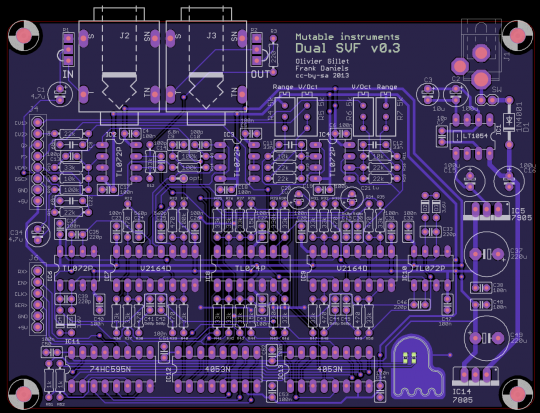](../static/images/pcb.png)

You can find the Eagle files for this board in the `shruthi/hardware_design/pcb directory` of the source code hosted on [github](https://github.com/pichenettes/shruthi-1/tree/xt/shruthi/hardware_design/pcb).

The schematics in PDF format are [here](../static/schematics/Shruthi-Analog-SVF-v03.pdf).

The position of all parts is shown on this [drawing](../static/images/shruthi_svf_top.pdf).

If you are wondering how it works, [this document](../static/documents/svf_analysis.pdf) provides an analysis and some design notes.

Bill of materials
-----------------

[Bill of materials (second half of the document)](https://docs.google.com/spreadsheet/pub?key=0Ai4xPbRS5YZjdDh1QmJMRjJMWlE3MFVXM0U4MUxqdGc&output=html). Note that the resistors from Digikey have minor differences in value (E48 vs E24 series). These differences are not critical.

Assembly instructions
---------------------

We assume you know soldering. If you don't, look first at [this tutorial](http://www.instructables.com/id/How-to-solder/). Be patient!

**DISCLAIMER:** We are not responsible for anything wrong (including electric shocks, malfunctions, fires, accidents involving a soldering iron) that might happen during the assembly of the kit. Everything you do while assembling the kit is at your own risks.

The assembly is done in two chapters: first, we build the power supply section, and then, the rest of the filter board. Building the power supply section first allows potentially destructive mistakes to be detected early.

### Power supply step 1: Capacitors

Add 1x 10pF ceramic capacitor (marked 100 = "10 with 0 extra zeros pF") in position C7. This part is not polarized. It tunes the frequency of the DC/DC converter which generates the negative voltage for powering the analog section. 

[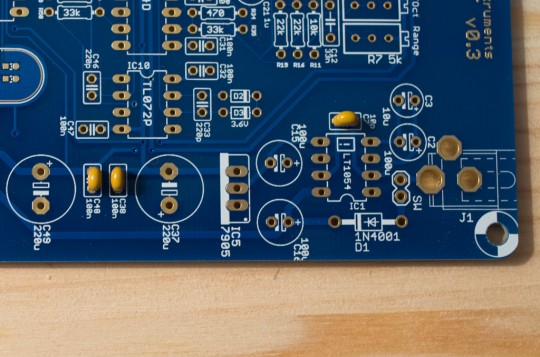](../static/images/svf-2.jpg)

Add 2x 100nF ceramic capacitors (marked 104 = "10 with 4 extra zeros = 100,000pF = 100nF") in positions C38 and C48. These parts are not polarized, and serve for power supply filtering. Note: the marking on these capacitors is very small and difficult to read. To help you recognize them: 1/ These are the only capacitors not attached to a cardboard strip. 2/ The print is much smaller than on the other values such as 10pF, 560pF, or 100pF.

### Power supply step 2: Diode and connectors

Add 1x 1N400x diode in position D1. The diode is **polarized**. The ring on the diode must be on the same side as the marking on the board. This diode serves as a protection in case a power supply with the wrong polarity is connected by mistake. Add 1x DIP8 IC socket in position IC1 - note that the notch is oriented towards the exterior of the board. Solder a jumper wire (for example a leg of a capacitor you have cut in the previous steps) between the two pads marked SW. This connection can be broken to solder an on/off switch. 

Solder the DC jack connector in position J1.

### Power supply step 3: More capacitors

Add one 10µF tantalum capacitor in position C3. This part is **polarized**. A small stripe is printed on the part and indicates the + lead, which should go in the hole marked + on the board. This part is a charge reservoir for the DC/DC converter. 

[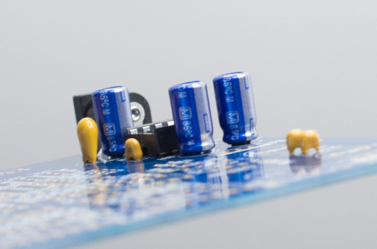](../static/images/svf-6.jpg)

Add 3x 100µF electrolytic capacitors in positions C2, C15 and C16. Note that the blue and tall 100µF capacitor shown on this photo was out of stock at the time the kit were prepared. Instead, your kit contains a smaller (about 8mm), black part. These capacitors are all **polarized** (and will pop if soldered with the wrong orientation!). The white stripe painted on the capacitor indicates its negative lead. The positive lead is the long one, and should go in the hole marked with a + on the PCB. These parts are used for power supply filtering. 

Add 2x 220µF electrolytic capacitors in positions C37 and C49. They are all **polarized** (and will pop if soldered with the wrong orientation!). The white stripe painted on the capacitor indicates its negative lead. The positive lead is the long one, and should go in the hole marked with a + on the PCB. These parts are used for power supply filtering.

### Power supply step 4: ICs

Solder the 7805 positive voltage regulator in position IC14, and the 7905 negative voltage regulator in position IC5. They have different names, hence are different parts, and should not be mixed up! They are also **polarized** - make sure the metal tab is oriented on the same side as on the picture (it is also depicted with a thick white line on the PCB). These parts output a smooth, steady voltage from whatever the wall-wart plugged into the unit delivers. Any excess of energy delivered by the wall-wart is dissipated as heat, so these parts can get quite hot! Insert the LT1054 DC/DC converter in the IC1 socket. This part is **polarized** - make sure it is inserted with the same orientation as on the picture.

### Power supply step 5: Voltage test

Connect a wall-wart with the following specifications:

-   Output voltage: 7.5V to 9V
-   Output current: 300mA or more
-   Polarity: - -( o- + (center tip positive)

[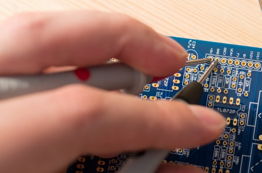](../static/images/svf-8.jpg)

Measure the voltage on a +5V point of the PCB. Check that it is between 4.9V and 5.1V. 

Measure the voltage on a -5V point of the PCB. Check that it is between -4.9V and -5.1V. All good? Let us dive into the assembly of the filter itself!

### Step 1: Jumper wires

[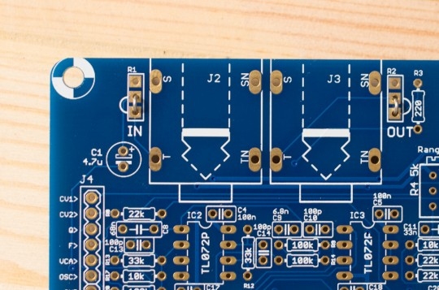](../static/images/svf-11.jpg)

Solder two pieces of wire between the two lower pads in positions R1 and R2. If you decide to build a custom case later, these pads can be used to solder input and output gain potentiometers.

### Step 2: Resistors, first decade

Add 1x 220R resistor (red red black black brown) in position R3. Add 8x 470R resistors (yellow purple black black brown) in positions R22, R23, R33, R34, R38, R39, R48 and R49. Resistors are not polarized - but it's a good idea to solder them just like on the photos in case you need the assistance of someone else to verify or troubleshoot your work.

### Step 3: Resistors, second decade

Add 2x 1.0k resistors (brown black black brown brown) in positions R51 and R52.

### Step 4: Resistors, third decade

Add 3x 10k resistors (brown black black red brown) in positions R10, R11 and R17. Add 2x 15k resistors (brown green black red brown) in positions R28 and R44. Add 6x 22k resistors (red red black red brown) in positions R8, R15, R16, R18, R19 and R21.

### Step 5: Resistors, fourth decade

Add 18x 33k resistors (orange orange black red brown).

### Step 6: Resistors, the last decade

[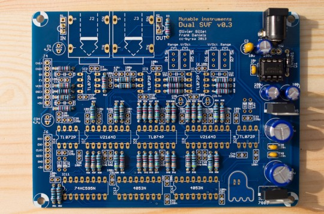{](../static/images/svf-16.jpg)

Add 4x 100k resistors (brown black black orange brown) in positions R9, R14, R20 and R24. Add 2x 330k resistors (orange orange black orange brown) in positions R29 and R45. Most of the resistors soldered in the previous steps work for setting gain factors in various stages of the circuitry - a wildly distorted or quiet output; or a filter control going rapidly out of range are often the consequence of incorrect resistor values.

### Step 7: Zener diodes

[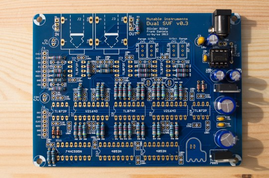](../static/images/svf-17.jpg)

Solder 4x 3.6V Zener diodes in positions D2, D3, D4 and D5. The diodes are **polarized** - the black ring of the diode must be on the same side as the ring printed on the symbol on the PCB. 

[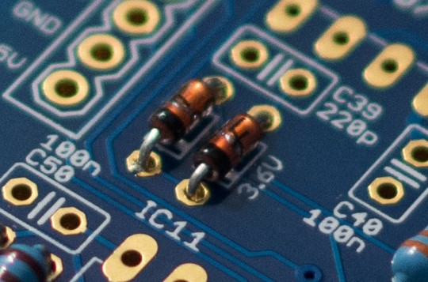](../static/images/svf-18.jpg)

These diodes work as voltage limiters. A pair of back to back 3.6V Zener diodes will force the signal to stay roughly within the -3.6V to 3.6V range. What is interesting is that this "limiting" effect is relatively gentle - no hard clipping occurs. This soft-limiting circuit is used in each filter, to prevent it from screaming when resonance is high - instead we get a gentle sinusoidal self oscillation! An interesting mod would be to use a switch to enable/disable them.

### Step 8: Ceramic capacitors

[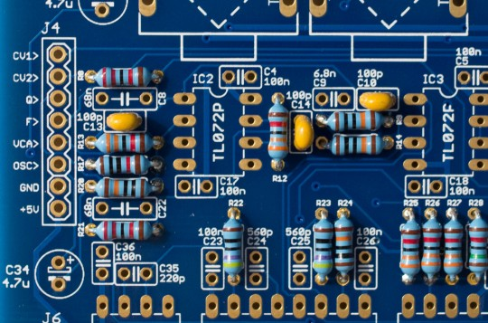](../static/images/svf-19.jpg)

Add 3x 100pF ceramic capacitors (marked 101 = "10 with 1 extra zero = 100pF") in positions C10, C13 and C14. These parts are not polarized, and tame high frequencies in the mixer, output amplifier, and VCA control circuits. 

[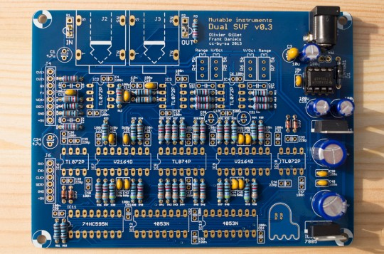](../static/images/svf-20.jpg)

Add 8x 560pF ceramic capacitors (marked 561 = "56 with 1 extra zero = 560pF") in positions C24, C25, C29, C30, C41, C42, C44 and C45. These parts are not polarized, and prevent high frequency signals from reaching the sensitive inputs of the V2164 ICs.

### Step 9: Ceramic capacitors

Add 21x 100nF ceramic capacitors (marked 104 = "10 with 4 extra zero = 100,000pF = 100nF"). These parts are not polarized, and serve as decoupling capacitors - local reservoirs of energy immediately available to each IC. Note: the marking on these capacitors is very small and difficult to read. To help you recognize them: 1/ These are the only capacitors not attached to a cardboard strip. 2/ The print is much smaller than on the other values such as 10pF, 560pF, or 100pF.

### Step 10: IC sockets

[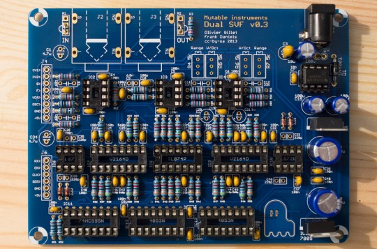](../static/images/svf-22.jpg)

Make sure that the notch of IC sockets is oriented on the same side as the notch on the PCB symbol. This does not change anything electrically, but having the notch in the right position is a helpful hint for correctly inserting the IC in the next steps! Add 5x DIP8 sockets in positions IC2, IC3, IC4, IC6 and IC10. Add 1x DIP14 socket in position IC8. Add 5x DIP16 sockets in positions IC7, IC9, IC11, IC12 and IC13.

### Step 11: Film capacitors

[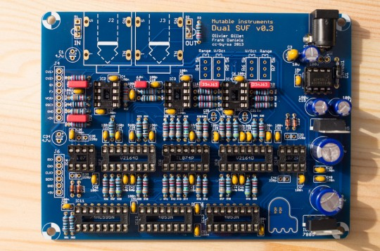](../static/images/svf-23.jpg)

Add 1x 6.8nF capacitor in position C9. The value "6.8n" or "6800" is printed on it. This cap smooths the VCA CV signal. Add 2x 33nF capacitors in positions C11 and C12. The value "33n" or "0.033" is printed on it. They smooth the two VCF frequency CV signals. Add 2x 68nF capacitors in positions C8 and C22. The value "68n" or "0.068" is printed on it. They smooth the two VCF resonance CV signals.

### Step 12: Connectors and trimmers

[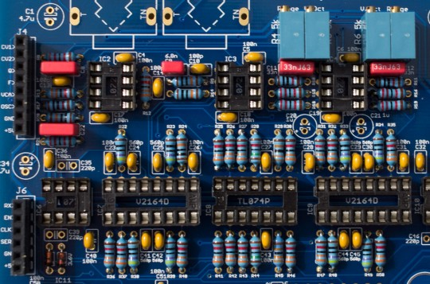](../static/images/svf-24.jpg)

Add the 1x8 and 1x6 connectors. Add the 4x 5k trimmers. Make sure that the screw is oriented towards the exterior of the board.

### Step 13: Non-polarized capacitors

Add the 2x 1.0µF NP capacitors in positions C20 and C21 and the 2x 4.7µF NP capacitors in positions C1 and C34. They are not polarized. They are used to block the DC component of the signal between various stages of the circuitry (and as such, prevent VCA CV feedthrough, which manifests itself as "pops").

### Step 14: Styroflex capacitors

Solder the 4x 220pF styroflex capacitors in positions C33, C35, C39 and C46. Bend the lead carefully! These parts are not polarized. They are the main filter capacitors - 2 of them per filter (this is a two-pole filter). Styroflex capacitors are available in small tolerances and have good temperature stability - they are thus good choices for filters.

### Step 15: Connectors and ICs

[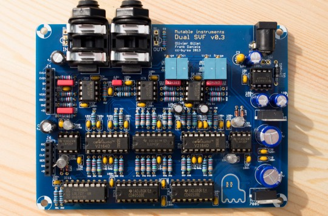](../static/images/svf-27.jpg)

Insert the ICs. They all have their notch oriented towards the left - at the exception of the LT1054! Solder the two audio connectors. Done!

Using this filter board
-----------------------

### Control board configuration and connections

To activate your SVF board, select **svf** for the **fil** setting in the system settings page. If you don't do so, it is likely that the filter will emit glitchy filtered sounds every time you navigate through the pages. After having made the change, press S6 (load/save), turn the encoder to select "ok" and click. This will save the filter board setting for future use. Make sure that both the analog (CV1 to +5V) and digital (RX to +5V) ports of the filter and control boards are connected.

### Controlling filter 2

When pressing the **S2** switch (Filter page) a second time, a new page is displayed allowing you to configure the filter routing and the cutoff/resonance of the secondary filter.

     Cut res md1 md2
     110   0 lpf +hp

The parameters are the following:

-   **cut (cutoff)**: Cutoff frequency of the secondary filter.
-   **res (resonance)**: Resonance of the secondary filter.
-   **md1 (mode 1)**: Mode of the main filter. The modes are **lpf** (low-pass), **bpf** (band-pass), and **hpf** (high-pass).
-   **md2 (mode 2)**: Mode of the secondary filter. The modes are **lp** (low-pass), **bp** (band-pass), and **hp** (high-pass). The first character indicates the filter topology. **+** is for the parallel mode ; **>** is for the serial mode.

### Relative control of filter 2

Three special modes are available for filter 1: **lp>**, **bp>**, **hp>**. In these modes, the cutoff frequency of filter 2 becomes relative to the cutoff frequency of filter 1 ; and the cutoff 2 setting controls the spacing between the two (with a value above 64 representing a positive shift and a value below 64 a negative shift). For example:

     Cut res md1 md2
      64   0 bp> +bp

The frequency of filter 2 is the same as the frequency of filter 1.

     Cut res md1 md2
      76   0 bp> +bp

Filter 2's cutoff is one octave (64 + 12 semitones = 76) above filter 1's cutoff.

     Cut res md1 md2
      52   0 bp> +bp

Filter 2's cutoff is one octave (64 - 12 semitones = 52) below filter 1's cutoff. This coupling mode is recommended for getting filter 2 to track the played note (since filter 1 does).

### Modulating filter 2

The CV1 and CV2 buses are used to transmit the cutoff and resonance settings of the secondary filter. Thus, you can use these as modulation destinations in the modulation matrix to route envelopes, LFOs, etc to the cutoff and resonance of the secondary filter. For example, if you want the second filter to be modulated by a LFO, this can be done with the following modulation patch:

     Mod src dst amt
       1 lf1 cv1  63

Calibration
-----------

Note that when the two boards are stacked (but not screwed), it is still possible to lift the control board while keeping it connected to access the 4 trimmers.

### Filter 1 tuning

The tuning procedure consists in making sure that the cutoff frequency of the filter follows a musical scale: increasing the cutoff setting on the Shruthi by 12 (or playing a note 1 octave = 12 semitones higher) should double the cutoff frequency. Power the Shruthi on and dial the following settings from the **init** patch:

-   Oscillator 1 shape: **none**
-   Oscillator 2 shape: **none**
-   Filter cutoff: **64**
-   Filter resonance: **63** (maximum value)
-   Filter envelope and LFO modulations: **0**

     Cut res env lfo
      64  63   0   0

Play on the keyboard. You should hear a pure tone (sine wave), which does not come from the Shruthi oscillators but from the filter self-oscillating. Adjust the first V/Oct trimmer (R5) so that the **intervals** are respected - that is to say, when you play C2 then C4, you should hear two notes, maybe not C2s and C4s, but they must be two octaves apart. If you do not have a good sense of pitch, you can try a software tuner like [Tuna Pitch](https://www.macupdate.com/app/mac/33029/tuna-pitch) on OS X. If the filter is correctly tuned, you should be able to play the filter "self oscillation tone" across roughly 4 octaves with correct tuning. Now, play and hold a note in the higher octaves. Sweep the **cutoff** control up. You will notice glitches/changes in pitch when cutoff reaches very high values above 110 - this is due to interactions between the filter self-oscillation and the digital carrier used to control the filter. If you want to get rid of them (they manifest themselves only when resonance is very high), turn the first Range trimmer (R4) so that this zone is out of reach - the downside will be that the filter will have a "darker" tone and that it won't be possible to fully open it.

### Filter 2 tuning

We assume that you have already dialled all settings for filter 1 tuning. Set the second filter settings to:

     Cut res md1 md2
      64  63 lp> +lp

The second filter is now active, in parallel with the first, with the same settings and key-tracking. You will now hear two tones whenever a note is played. Adjust filter 2's Range and V/Oct trimmer so that the two tones are fused into one - it will be very hard to get them to be exactly aligned, but getting a mild beating/chorusing between the two notes is enough!

Tweaks and mods
---------------

### VCA bleed compensation

Solder the remaining 2M resistor (red black black yellow) between the two pads marked "opt" to totally close the VCA when no note is played. This has the slightly negative effect of reducing the smoothness of the VCA envelope. You can also try a higher value below 10M.

### For advanced builders only: ghost eyes

The two minuscule LEDs are for the ghost eyes. Since getting their orientation right is tricky, here is how we recommend doing it:

1.  Connect the control board to the filter board, set the resonance to 63 (this is one of the ways of getting the ghost eyes to light up)
2.  Disconnect the control board and keep the filter board powered.
3.  Check that you have +5V on the lower pad of each eye.
4.  Put one LED in place with tweezers. Change its position/orientation until it lights up. Solder it. Good luck!
5.  Repeat the same procedure for the other LED.

License
-------

This circuit and PCB layout is made available under a **cc-by-sa-3.0** license.

Kudos
-----

David Dixon and Tom Wiltshire for precious discussions on SSM2164 SVF design.
